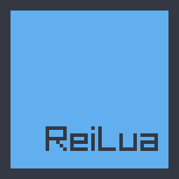

## About

Please note that ReiLua is lovingly :heart: handcrafted and will likely contain bugs and documentation errors so it would be much appreciated if you would report any such findings.

Idea of this project was to bring the power and simplicity of Raylib to easy beginner friendly language like Lua in a very straight forward manner. It is loose binding to Raylib, some functions will not be included and some are added. The idea of pointing "main.lua" file and access functions "init", "update" and "draw" are borrowed from Löve game framework.

ReiLua is not planned to be a one-to-one binding to raylib. If you want more direct bindings, there are other projects like https://github.com/TSnake41/raylib-lua.

Reilua means fair in finnish.

## Status

ReiLua is WIP and some planned raylib functionality is still missing but it already has over 1000 functions. Current Raylib version 5.5.

Included submodules.

* Raygui
* Raymath
* Lights
* Easings
* RLGL

List of some MISSING features that are planned to be included. For specific function, check API and apiScanner.lua.

* Core
	* VR stereo config functions for VR simulator
* Audio
	* AudioStream management functions

## Roadmap

* v0.9

* v1.0
	* raylib 6.0

## Usage

Application needs 'main.lua' or 'main' file as entry point. ReiLua executable will first look it from same directory. Alternatively, path to the folder where "main.lua" is located can be given as argument. There are seven Lua functions that the framework will call, 'RL.init', 'RL.update', 'RL.draw', 'RL.event', 'RL.log', 'RL.exit' and 'RL.config'.

Example of basic "main.lua" file that will show basic windows with text.

```Lua
local textColor = RL.BLACK
local textPos = { 192, 200 }
local textSize = 20
local text = "Congrats! You created your first window!"

function RL.init()
	RL.SetWindowTitle( "First window" )
	RL.SetWindowState( RL.FLAG_VSYNC_HINT )
end

function RL.update( delta )
	if RL.IsKeyPressed( RL.KEY_ENTER ) then
		local winSize = RL.GetScreenSize()
		local measuredSize = RL.MeasureTextEx( RL.GetFontDefault(), text, textSize, 2 )
		
		textColor = RL.BLUE
		textPos = { winSize[1] / 2 - measuredSize[1] / 2, winSize[2] / 2 - measuredSize[2] / 2 }
	end

	if RL.IsKeyPressed( RL.KEY_SPACE ) then
		textColor = RL.RED
		textPos = { 192, 200 }
	end
end

function RL.draw()
	RL.ClearBackground( RL.RAYWHITE )
	RL.DrawText( text, textPos, textSize, textColor )
end
```

Application folder structure should be...

```
GameFolder
 \ReiLua.exe
 \main.lua
```

Application should now start successfully from executable. All functionality can be found in "API".

ReiLua_API.lua can be put into project folder to provide annotations when using "Lua Language Server".

## Object unloading

Some objects allocate memory that needs to be freed when object is no longer needed. By default objects like Textures are unloaded by the Lua garbage collector. It is generatty however recommended to handle this manually in more complex projects. You can change the behavior with:

```
RL.SetGCUnload()
```

## Interpreter Mode

ReiLua can also be used to run single lua file using interpreter mode with arguments -i or --interpret. Given file will be called with dofile. Usage example:

```
./Reilua -i hello.lua
```

## Generate API

Generate API.md and ReiLua_API.lua from build folder with command.

```
./Reilua -i ../docgen.lua
```

## Building

I think the simplest way would be to statically link Raylib and Lua to the same executable. Specially on Linux this would simplify distribution of games since different distros tend to use different versions of librarys. Of course if you plan to only experiment with it, this isn't so important.

https://github.com/raysan5/raylib

https://github.com/lua/lua or https://github.com/LuaJIT/LuaJIT

Note! Lua header files are from Lua 5.4.0, if you use different version be sure to replace them.

### Linux

Compile Raylib and lua by following their instructions. They will compile to libraylib.a and liblua.a by default.

You need build essential and cmake. If you compiled Raylib you should already have these.

```
sudo apt install build-essential
sudo apt install cmake
```

If compiling statically, move libraylib.a and liblua.a to "ReiLua/lib" folder. From "ReiLua" folder...

```
cd build
cmake ..
make
```

Run example.

```
./ReiLua ../examples/snake/
```

If you now see extremely low res snake racing off the window then you are successfull. Congratulations! You can reset the game by pressing enter.

### Windows

* Download "w64devkit" from https://github.com/skeeto/w64devkit and "CMake" from https://cmake.org/download/. Install CMake with path environment variables set.
* Download Raylib source.
* Run "w64devkit.exe" and navigate( ls == dir ) to "raylib/src" folder and run...

```
mingw32-make
```

* You should now have "libraylib.a" file in that folder.
* Copy that to "ReiLua/lib" folder.
* Download Lua source from https://github.com/lua/lua
* Make following changes to Lua's makefile so we can build on Windows.

```
MYCFLAGS= $(LOCAL) -std=c99 -DLUA_USE_LINUX -DLUA_USE_READLINE
# to
MYCFLAGS= $(LOCAL) -std=c99

# And comment out or remove line.
MYLIBS= -ldl -lreadline
```

* Navigate "w64devkit" to Lua folder and build using.

```
mingw32-make
```

* There should now be "liblua.a" file in Lua folder.
* Copy that also to "ReiLua/lib" folder.
* Navigate to "ReiLua/build" folder on "w64devkit" and run...

```
cmake -G "MinGW Makefiles" ..

# Cmake uses NMake Makefiles by default so we will set the Generator to MinGW with -G

mingw32-make
```

* You should now have "ReiLua.exe".

Run example.

```
./ReiLua.exe ../examples/snake/
```

If you now see extremely low res snake racing off the window then you are successfull. Congratulations! You can reset the game by pressing enter.

### MacOS

Not tested, but I guess it should work similarly to Linux.

### Raspberry Pi

Works best when Raylib is compiled using PLATFORM=DRM. See Raylib build instructions for Raspberry Pi.
Compile ReiLua with.
```
cmake .. -DDRM=ON
```
Note that DRM should be launched from CLI and not in X.

### Web

Compile Raylib for web by following it's instructions. https://github.com/raysan5/raylib/wiki/Working-for-Web-(HTML5)#1-install-emscripten-toolchain

Lua can be compiled by making few changes to it's makefile.
```
MYCFLAGS= $(LOCAL) -std=c99 -DLUA_USE_LINUX -DLUA_USE_READLINE
# to
MYCFLAGS= $(LOCAL) -std=c99

MYLIBS= -ldl -lreadline
# to
MYLIBS= -ldl

CC= gcc
# to
CC= emcc

CFLAGS= -Wall -O2 $(MYCFLAGS) -fno-stack-protector -fno-common -march=native
# to
CFLAGS= -Wall -O2 $(MYCFLAGS) -fno-stack-protector -fno-common

AR= ar rc
# to
AR= emar

# And a little bit more down.
	$(AR) $@ $?
# to
	$(AR) rcs $@ $?
```

* If your enviromental variables for "emsdk" are correct, you should be able to compile with make.
* You should now have "libraylib.a" and "liblua.a" librarys.
* Put them into "ReiLua/lib/web/".
* Navigate into "ReiLua/build/".

Emscripten builds the resources like lua files and images to "ReiLua.data" file so we will create folder called "resources" that should include all that. "resources" should also be included in all resource paths. "main.lua" should be located in the root of that folder. So we should now have.

```
ReiLua
 \build
 |\resources
 ||\main.lua
```

We can now build the game. You can use the command in the top of the "CMakeLists.txt" to use emsdk toolchain with cmake. Remember to replace \<YOUR PATH HERE> with correct path.

```
cmake .. -DCMAKE_TOOLCHAIN_FILE=<YOUR PATH HERE>/emsdk/upstream/emscripten/cmake/Modules/Platform/Emscripten.cmake -DPLATFORM=Web
make
```

You should now have "ReiLua.html", "ReiLua.js", "ReiLua.wasm" and "ReiLua.data". You can test the game by creating localhost with Python.

```
python -m http.server 8080
```

You should now be able to access the webpage from browser.

```
localhost:8080/ReiLua.html
```
